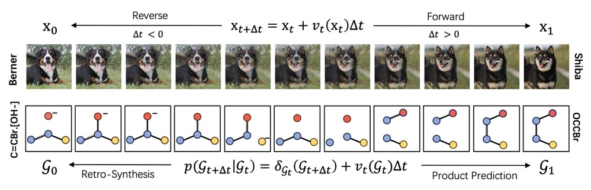

# SynBridge: Bridging Reaction States via Discrete Flow for Bidirectional Reaction Prediction
<p align="center">
    
    <br/>
</p>
This is the official codebase of [Synbridge](https://arxiv.org/abs/2507.08475) for reproduction.

## Installation

#### Create the conda environment and activate it.
```bash
conda create -n synbridge python==3.10
conda activate synbridge
```
#### Install basic packages
```bash
# install requirements
pip install -r requirements.txt
```

## Dataset 
We provide the processed dataset of `USPTO-50K` and `USPTO-MIT` through [hugging face](https://huggingface.co/datasets/Delcher/synbridge-uspto).
The raw datasets are `.txt` and `.csv`  file, while the parsed ones are `.pickle` file.

Please download `data.zip` and unzip it, leading to the data file directoory as 
```
- data
    - uspto50k
        raw_test.csv
        raw_train.csv
        raw_val.csv
        test_data.pickle
        test.txt
        train_data.pickle
        ...
    - usptomit
        raw_test.csv
        raw_train.csv
        raw_val.csv
        test_data.pickle
        test.txt
        train_data.pickle
        ...
```
If you want the raw datasets for preprocessing, please refer to 
`./preprocess/preprocess_txt.py`
## Training and Generating
> **Note** This branch is mainly based on multitask reproduction, if you want to run SynBridge on separate tasks, please turn to [Separate Branch](https://github.com/EDAPINENUT/synbridge/tree/separate).
### Training from scratch
Run the following command for training the multi-task version of synbridge:

```bash
python train.py --config-name={config_name} \
train.devices={available_world_size}
```
where `config_name` should be in `difm_mix_uspto50k` or `difm_mix_usptomit`. 
The hyper-parameters for uspto-mit training are based on 8 x Nvidia A100 GPUs. If computational resources are difficult to support intensive training, we recommend reducing the mol_encoder layers to 2, merge_encoder layers to 6, and batch_size to 512, which can still produce a decent small model.
That is:

```bash
python train.py --config-name=difm_mix_usptomit \
mol_encoder.nlayer=2 \
merge_encoder.nlayer=6 \
train.batch_size=512 \
train.devices=4
```

#### After training, you can choose an epoch for generating the peptides through:

```
python test.py --ckpt_path {/path/to/your/checkpoint.ckpt} \
--config_path {/path/to/your/config.yaml} \
--save_samples \
--eval_mode {eval_mode}
```
where `eval_mode` should be in `forward` or `retro`.

### Testing from pretrained checkpoints
We provide pretrained models on [Hugging Face](https://huggingface.co/Delcher/synbridge/tree/main). After downloading, store them in `./ckpts/{dataset}_{task}/`, which results in the following ckpts folder structure:
```
- ckpts
    - usptomit_mix
        epoch=561-step=224000.ckpt
        config.yaml
        
    - uspto50k_mix
        epoch=721-step=57000.ckpt
        config.yaml
```
Use the following command to test on the test set:
```bash
# test the multitask model on uspto50k on forward task
python test.py --ckpt_path ./ckpts/uspto50k_mix/epoch=721-step=57000.ckpt \
--config_path ./ckpts/uspto50k_mix/config.yaml \
--eval_mode forward \
--save_samples 
# test the multitask model on uspto50k on retro task
python test.py --ckpt_path ./ckpts/uspto50k_mix/epoch=721-step=57000.ckpt \
--config_path ./ckpts/uspto50k_mix/config.yaml \
--eval_mode retro \
--save_samples 

# test the multitask model on usptomit on forward task
python test.py --ckpt_path ./ckpts/usptomit_mix/epoch=561-step=224000.ckpt \
--config_path ./ckpts/usptomit_mix/config.yaml \
--eval_mode forward \
--save_samples 
# test the multitask model on usptomit on retro task
python test.py --ckpt_path ./ckpts/usptomit_mix/epoch=561-step=224000.ckpt \
--config_path ./ckpts/usptomit_mix/config.yaml \
--eval_mode retro \
--save_samples 
```

## Citation
If our paper or the code in the repository is helpful to you, please cite the following:
```
@misc{lin2025synbridgebridgingreactionstates,
      title={SynBridge: Bridging Reaction States via Discrete Flow for Bidirectional Reaction Prediction}, 
      author={Haitao Lin and Junjie Wang and Zhifeng Gao and Xiaohong Ji and Rong Zhu and Linfeng Zhang and Guolin Ke and Weinan E},
      year={2025},
      eprint={2507.08475},
      archivePrefix={arXiv},
      primaryClass={cs.LG},
      url={https://arxiv.org/abs/2507.08475}, 
}
```

